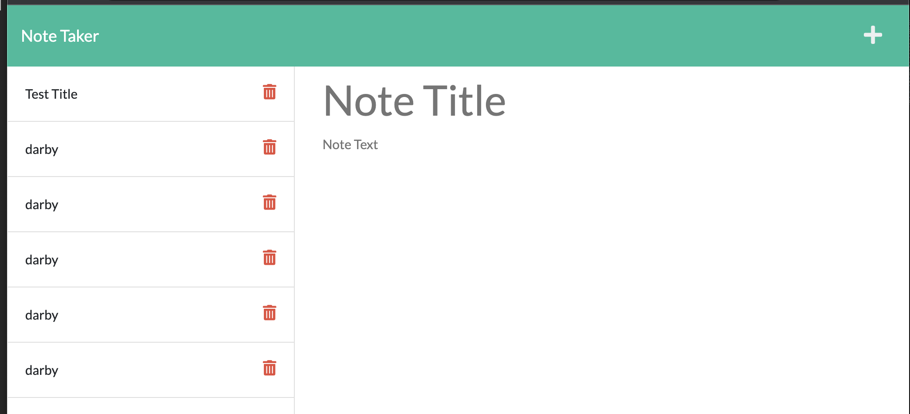

# Note-Taker

  
       
  ## Description
  To generate a note taker application using Express.js  and JSON files to save and retrieve data.  the application when finished is going to be deployed on Heroku. 
  
  ## Table of Contents

  *[Installation](#installation)

  *[Usage](#usage)

  *[License](#license)

  *[Contributing](#contributing)

  *[Test](#test)

  *[Questions](#questions)
  
  
  ## Installation

  npm install express
  
  ## Usage

  you write a title for your notes and then a description, then you save the file and itll be deployed to the side  of the application.
  
  ## License
  
  This project is licensed under 

  ## Contributing

  Darby Biddy
  
  ## Test
  Using Jest Framework. Run npm test 
  
  ## Questions

To see more of my projects, go to [Darbybiddy](https://github.com/Darbybiddy)
If you have any questions, you can contact me at [darbybiddy3@gmail.com](mailto:darbybiddy3@gmail.com)